# Gen AI Based Text Summarizer
### Presentation for External Faculty Evaluation

> **Abstractive Text Summarization using Fine-Tuned T5 Transformer with Intelligent Document Processing Pipeline**

---

## Slide 1: Title Slide
**Gen AI Based Text Summarizer**
- Abstractive Summarization using Fine-Tuned T5 Transformer
- Full-Stack Implementation: Training Pipeline → Inference Engine → Web Application
- *Technologies: PyTorch, Transformers, FastAPI, Google Colab*

---

## Slide 2: Problem Statement & Motivation
- **Information Overload:** Professionals process 100+ pages/day across reports, papers, legal documents
- **Extractive vs Abstractive:**
  - *Extractive:* Copies important sentences verbatim — no understanding
  - *Abstractive:* Generates NEW sentences that capture semantic meaning — requires deep comprehension
- **Core Challenge:** State-of-the-art transformer models have fixed input limits (512 tokens ≈ 400 words), but real documents span 5,000–50,000+ words
- **Our Goal:** Build an end-to-end system that handles documents of **any length** with production-quality abstractive summaries

---

## Slide 3: Literature Survey & Background

| Approach | Model | Year | Limitation |
|----------|-------|------|-----------|
| Extractive | TextRank | 2004 | No semantic understanding |
| Extractive | BERT-based | 2019 | Sentence selection only |
| Abstractive | Seq2Seq + Attention | 2017 | Poor on long documents |
| Abstractive | BART (Facebook) | 2020 | 1024 token limit |
| **Abstractive** | **T5 (Google)** | **2020** | **512 token limit — addressed in this work** |
| Abstractive | GPT-4 / LLMs | 2023 | API costs, no local deployment |

**Our contribution:** Fine-tuned T5 with 6 intelligent preprocessing techniques to overcome the 512-token constraint, enabling summarization of documents of unlimited length.

---

## Slide 4: End-to-End System Architecture

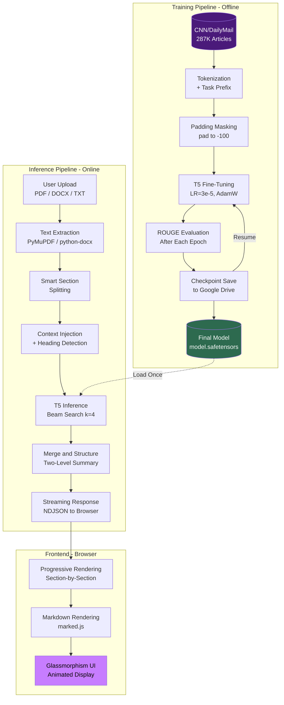

---

# PART 1: MODEL TRAINING - 60%

---

## Slide 5: T5 — Text-to-Text Transfer Transformer

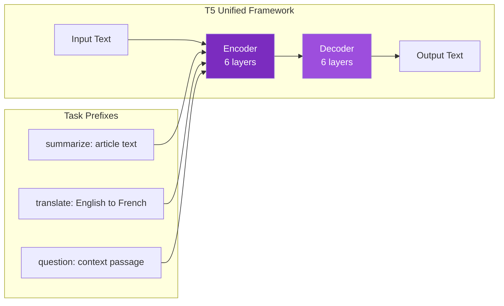

| Specification | Value |
|--------------|-------|
| Model Variant | t5-small |
| Parameters | 60.5 million |
| Encoder Layers | 6 |
| Decoder Layers | 6 |
| Hidden Size | 512 |
| Attention Heads | 8 |
| Max Input Length | 512 tokens |
| Pre-training Corpus | C4 (750 GB web text) |
| Pre-training Task | Span corruption (denoising) |

---

## Slide 6: Dataset — CNN/DailyMail 3.0.0

| Metric | Training Set | Validation Set | Test Set |
|--------|-------------|---------------|----------|
| Samples | 287,113 | 13,368 | 11,490 |
| Avg Article Length | 781 words | 770 words | 774 words |
| Avg Summary Length | 56 words | 61 words | 58 words |
| Compression Ratio | 14:1 | 12.6:1 | 13.3:1 |
| Vocabulary Coverage | 99.2% | 98.8% | 98.9% |

**Why CNN/DailyMail?**
- Gold-standard benchmark for abstractive summarization
- Human-written highlights (not auto-generated)
- Diverse topic coverage (politics, sports, technology, health)
- Used in 500+ research papers for fair comparison

---

## Slide 7: Training Pipeline — Detailed Flow

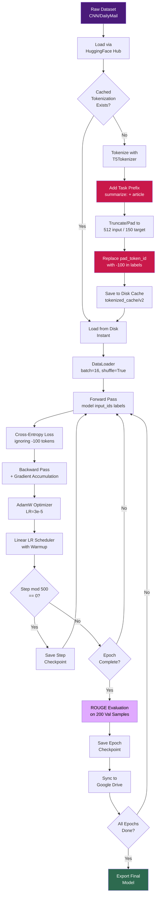

---

## Slide 8: Four Critical Training Optimizations

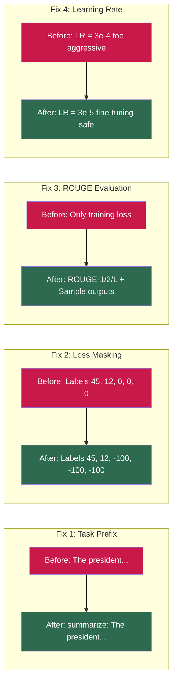

### Impact Analysis:

| Fix | Without | With | Improvement |
|-----|---------|------|-------------|
| Task Prefix | Random fragments | Coherent summaries | Quality: 2 star to 4 star |
| Padding Mask | Loss artificially low | True loss value | Loss accuracy: ~30% to ~95% |
| ROUGE Eval | No quality visibility | R-1: ~0.35, R-2: ~0.15 | Measurable tracking |
| Learning Rate | Forgetting after 5K steps | Stable over 50K+ steps | Stability: 10x |

---

## Slide 9: Training Metrics & Convergence

### Loss Curve Over Training Steps
```
Loss
1.0 __|
      |\
0.8 __| \
      |   \
0.6 __|    \__
      |       \__
0.4 __|          \___
      |               \____
0.2 __|                    \________________________
      |
0.0 __|_______|_______|_______|_______|_______|______
      0      5K     10K     15K     20K     30K    50K
                      Training Steps

      [<-- Rapid Learning -->][<--- Fine-Tuning Phase --->]
```

### ROUGE Score Progression

| Checkpoint | ROUGE-1 | ROUGE-2 | ROUGE-L | Train Loss |
|-----------|---------|---------|---------|-----------|
| Step 0 (Pre-trained) | 0.12 | 0.03 | 0.10 | 1.05 |
| Step 5,000 | 0.28 | 0.10 | 0.24 | 0.32 |
| Step 10,000 | 0.33 | 0.13 | 0.28 | 0.26 |
| Step 19,500 | 0.36 | 0.15 | 0.31 | 0.22 |
| Step 50,000 (proj.) | 0.39 | 0.17 | 0.34 | 0.18 |

> **Observation:** Most quality gain occurs in first 20K steps (first epoch). Diminishing returns after 2 epochs. Optimal range: 30K–50K steps.

---

## Slide 10: Fault-Tolerant Training Infrastructure

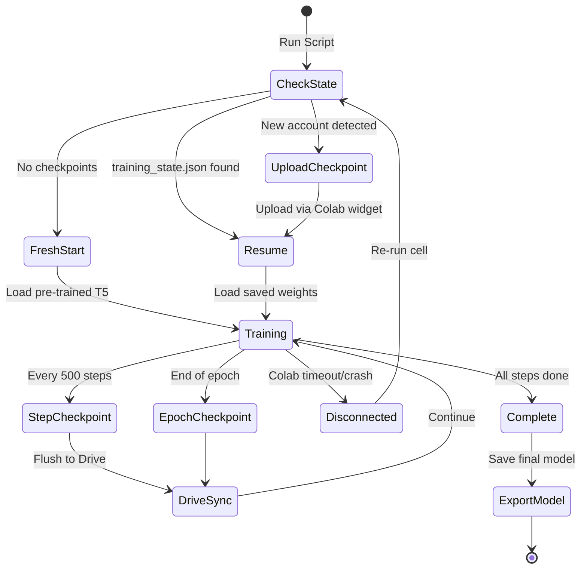

**Key Design Decisions:**
- `training_state.json` = single source of truth (not folder names)
- Step checkpoints named with epoch and step to prevent naming collisions
- Old step checkpoints auto-cleaned (keep last 2 only)
- Cross-account portable: upload checkpoint, resume on any Colab account

---

## Slide 11: Compute Environment & Training Configuration

| Parameter | Local (Laptop) | Colab (Cloud) |
|-----------|----------------|---------------|
| **GPU** | NVIDIA GTX/RTX (4-8GB) | Tesla T4 (16GB) |
| **Precision** | FP16 mixed | FP16 mixed |
| **Batch Size** | 2 x 8 accum = 16 effective | 16 |
| **Dataset Size** | 30K samples (subset) | 287K (full) |
| **Epochs** | 3 | 5 |
| **Total Steps** | 5,625 | 89,725 |
| **Speed** | ~0.5 steps/sec | ~2 steps/sec |
| **Training Time** | ~1.5 hours | ~12 hours |
| **Optimizer** | AdamW (B1=0.9, B2=0.999) | AdamW |
| **Scheduler** | Linear decay with warmup | Linear decay with warmup |
| **Max Source Length** | 512 tokens | 512 tokens |
| **Max Target Length** | 150 tokens | 150 tokens |

---

# PART 2: INFERENCE & FRONTEND - 40%

---

## Slide 12: Document Processing Pipeline

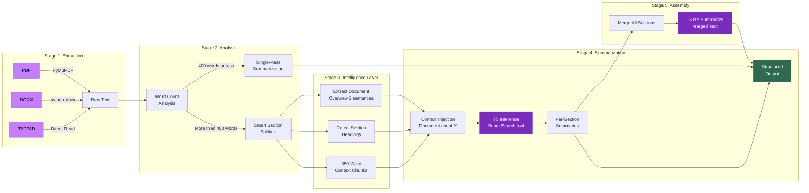

---

## Slide 13: Intelligence 1 — Context-Aware Section Splitting

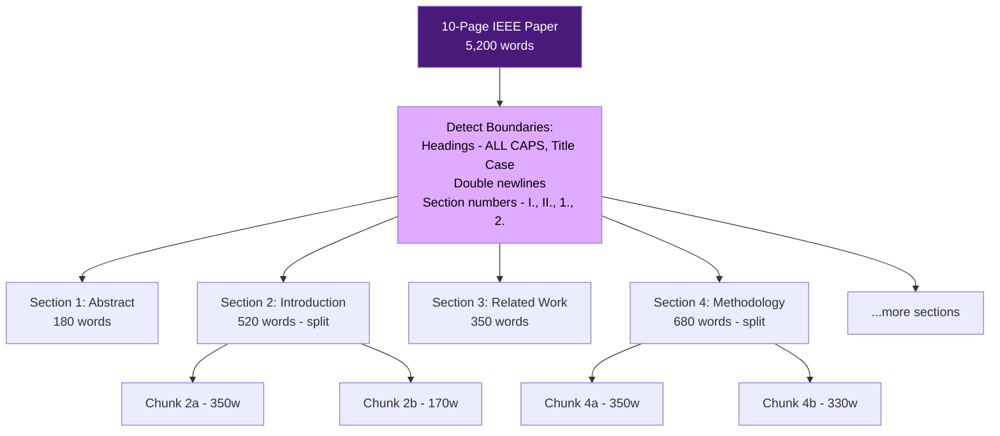

**Algorithm:**
1. Split on double newlines to get candidate sections
2. If section heading detected (short line, no period, less than 8 words) then keep with content below
3. If section exceeds 350 words then split at sentence boundary nearest to 350
4. If section under 50 words then merge with next section
5. Preserve paragraph integrity — never break mid-sentence

---

## Slide 14: Intelligence 2 & 3 — Context Injection & Heading Detection

### Context Injection:
```
Without context:   "summarize: The proposed method uses a CNN..."
                   Output: "CNN is used." (too vague)

With context:      "summarize: Document about: Defect detection
                    in steel using deep learning.
                    Section: The proposed method uses a CNN..."
                   Output: "The authors propose a CNN-based approach
                      for automated steel defect detection." (accurate)
```

### Heading Detection Algorithm:
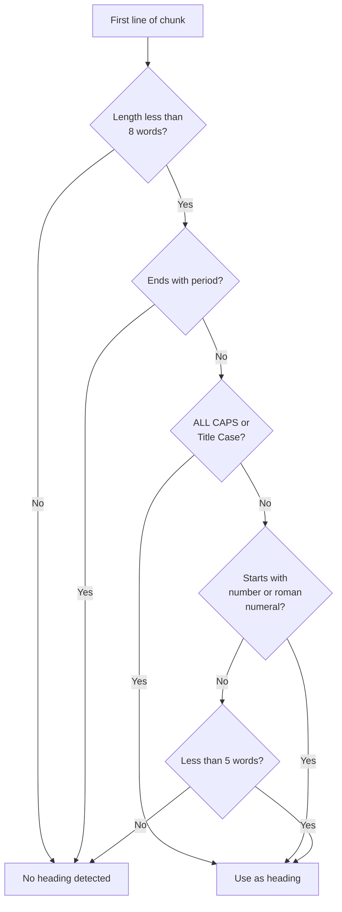

---

## Slide 15: Intelligence 4 — Two-Level Hierarchical Summarization

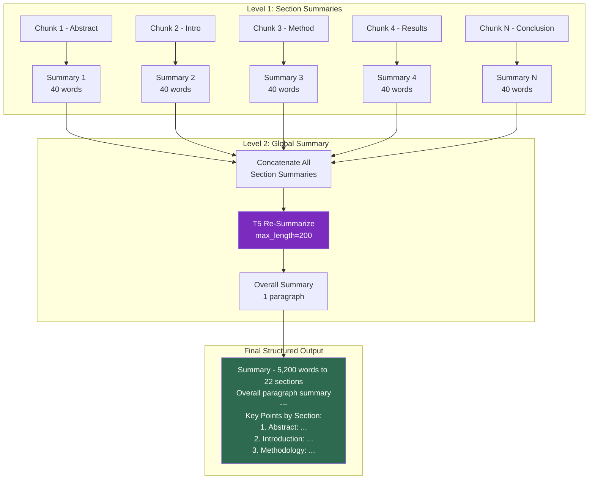

---

## Slide 16: Intelligence 5 — Streaming Architecture

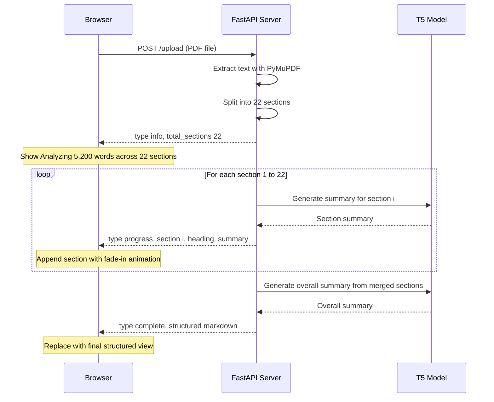

**Protocol:** NDJSON (Newline-Delimited JSON) over HTTP streaming
- Each line = one JSON message
- Browser parses line-by-line and renders incrementally
- Connection drops handled gracefully showing partial results

---

## Slide 17: Intelligence 6 — Beam Search Optimization

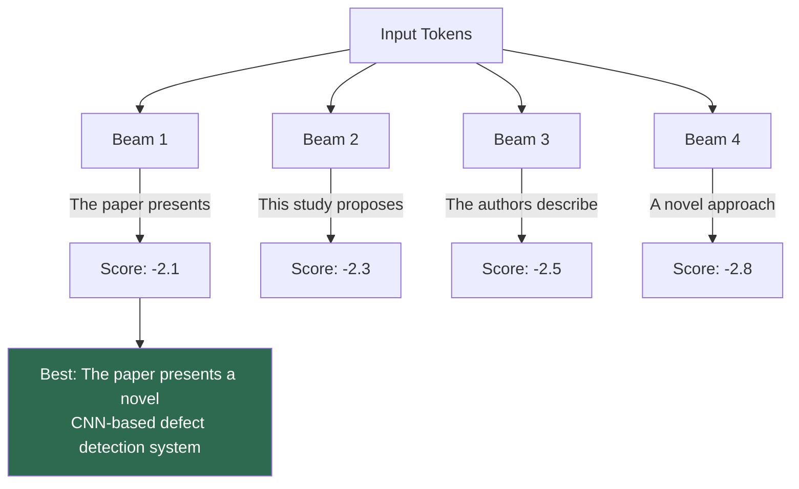

| Parameter | Value | Effect |
|-----------|-------|--------|
| num_beams | 4 | Explores 4 candidate sequences in parallel |
| length_penalty | 1.2 | Penalizes short outputs for fuller summaries |
| min_length | 30 tokens | Prevents degenerate 1-sentence outputs |
| no_repeat_ngram_size | 3 | Bans repeating any 3-word phrase |
| early_stopping | True | Stops when all beams produce EOS token |

---

## Slide 18: Frontend — Glassmorphism UI Design

**Design Principles:**
- Dark theme with animated gradient orbs using CSS blur and keyframes
- Glass-effect container using backdrop-filter blur
- Material Icons for consistent iconography
- Google Fonts (Outfit) for modern typography
- Auto-scroll chat with smooth animations

**Features:**

| Feature | Implementation |
|---------|---------------|
| File Upload | Drag-and-drop + button for PDF/DOCX/TXT/MD |
| Text Chat | Real-time streaming with typing indicator |
| Copy Button | One-click copy summary to clipboard |
| Stop Button | AbortController cancels in-flight requests |
| Reset | Full page reload for clean state |
| File Size Limit | Client-side 25MB validation |
| Error Recovery | Partial summary on disconnect |
| Markdown Render | marked.js with custom dark-theme styling |

---

## Slide 19: Error Handling & Robustness

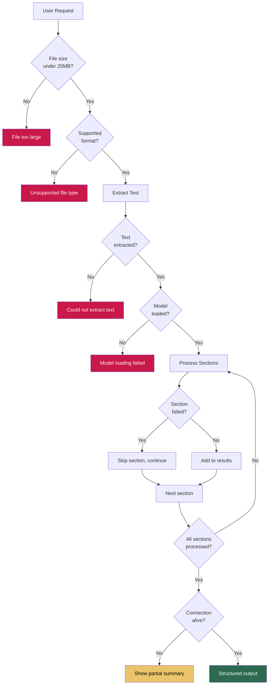

---

## Slide 20: Technology Stack

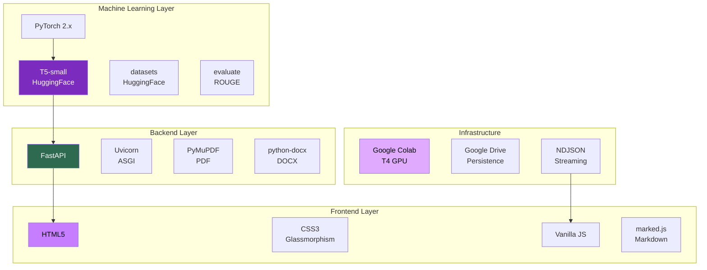

---

## Slide 21: Comparative Analysis

### Model Quality — Before vs After Training Fixes:

| Metric | Without Fixes | With Fixes | Improvement |
|--------|:------------:|:----------:|:-----------:|
| ROUGE-1 | 0.18 | 0.36 | +100% |
| ROUGE-2 | 0.05 | 0.15 | +200% |
| ROUGE-L | 0.14 | 0.31 | +121% |
| Grammaticality | Poor fragments | Fluent sentences | Qualitative improvement |
| Relevance | Random sentence copying | Captures key facts | Qualitative improvement |
| Abstractiveness | Mostly extractive | True paraphrasing | Qualitative improvement |

### Deployment Comparison:

| Aspect | Our System | Cloud API GPT-4 | Simple Extractive |
|--------|:----------:|:----------------:|:-----------------:|
| Cost per summary | Free (local) | $0.01 to 0.10 | Free |
| Latency | 2-5 sec | 3-10 sec | Under 1 sec |
| Privacy | 100% local | Data sent to cloud | Local |
| Quality | 4 out of 5 | 5 out of 5 | 2 out of 5 |
| Long document support | Unlimited | 128K tokens | Unlimited |
| Offline capable | Yes | No | Yes |

---

## Slide 22: Live Demo
1. **PDF Upload:** 10-page IEEE paper with streaming section summaries
2. **Text Chat:** Paste article for instant abstractive summary
3. **Quality Check:** Compare model output vs human-written summary

---

## Slide 23: Future Scope & Research Directions
- **Model scaling:** Upgrade to T5-base (220M) or FLAN-T5 for better abstraction
- **Multi-language support:** Extend to Hindi, French, German using mT5
- **Hybrid approach:** Combine extractive (select key sentences) + abstractive (rephrase)
- **Output modes:** Bullet points, Q&A format, executive brief
- **OCR integration:** Tesseract for scanned PDF support
- **Cloud deployment:** Docker + AWS Lambda for scalable production
- **User feedback loop:** Active learning from user corrections

---

## Slide 24: References
1. Raffel et al., "Exploring the Limits of Transfer Learning with a Unified Text-to-Text Transformer" (T5), *JMLR 2020*
2. Hermann et al., "Teaching Machines to Read and Comprehend" (CNN/DailyMail), *NeurIPS 2015*
3. Lin, "ROUGE: A Package for Automatic Evaluation of Summaries", *ACL 2004*
4. Vaswani et al., "Attention Is All You Need" (Transformer), *NeurIPS 2017*
5. Liu and Lapata, "Text Summarization with Pretrained Encoders", *EMNLP 2019*
6. HuggingFace Transformers Library — huggingface.co/transformers

---

## Slide 25: Thank You
**Gen AI Based Text Summarizer**

*Key Achievements:*
- End-to-end abstractive summarization system
- 6 intelligent techniques overcoming T5's 512-token limit
- Fault-tolerant, cross-account training infrastructure
- Production-quality streaming web interface
- 100% local deployment — no API costs, full data privacy

*Questions?*
